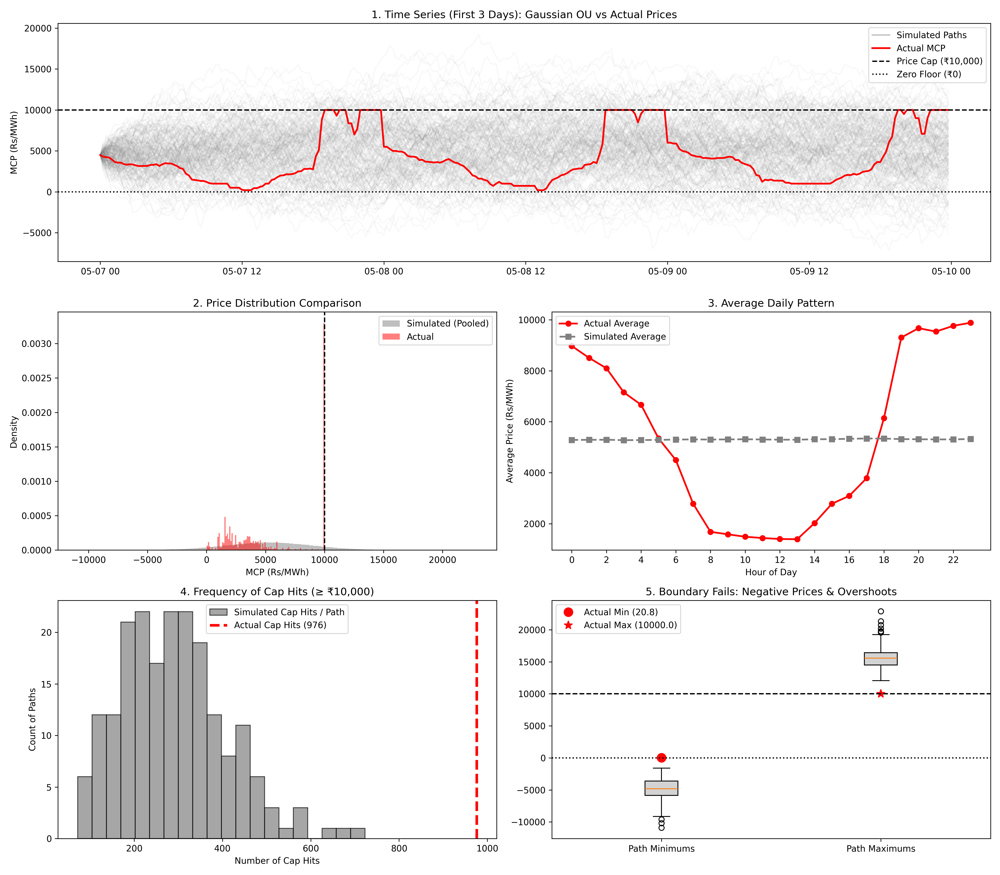
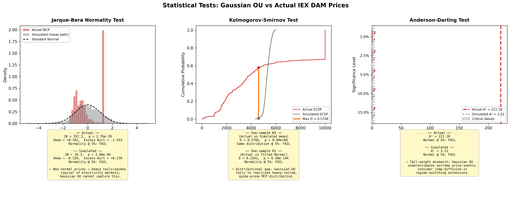

# ⚡ Stochastic Modeling of Electricity Spot Prices Using Ornstein-Uhlenbeck Process

> **Modeling and simulating Indian Energy Exchange (IEX) Day-Ahead Market (DAM) electricity prices using a Gaussian Ornstein-Uhlenbeck (OU) process — with rigorous statistical validation.**

---

## 📋 Project Overview

This project applies continuous-time stochastic modeling to Indian electricity spot prices from the **IEX Day-Ahead Market**. The Ornstein-Uhlenbeck (OU) process — a mean-reverting diffusion widely used in energy finance — is calibrated to real 15-minute Market Clearing Price (MCP) data and stress-tested against empirical observations.

### Key Objectives

1. **Calibrate** a Gaussian OU process to real IEX DAM prices via OLS on the discretised AR(1) representation.
2. **Simulate** 200 Monte Carlo price paths and compare them against observed market behaviour.
3. **Statistically validate** the Gaussian assumption using Jarque-Bera, Kolmogorov-Smirnov, and Anderson-Darling tests.
4. **Document limitations** of the Gaussian OU model for electricity price modeling (spikes, price caps, non-normality).

---

## 📊 Dataset

| Property | Value |
|---|---|
| **Source** | Indian Energy Exchange (IEX) — Day-Ahead Market Snapshot |
| **Period** | 7 May 2026 – 6 June 2026 (31 days) |
| **Granularity** | 15-minute intervals (96 time blocks/day) |
| **Observations** | 2,976 (after cleaning) |
| **Target Variable** | MCP (Rs/MWh) — Market Clearing Price |
| **Price Range** | ₹20.81 – ₹10,000.00 (regulatory cap) |
| **Mean MCP** | ₹5,292.27 |
| **Median MCP** | ₹3,956.71 |

---

## 🧮 Methodology

### 1. Ornstein-Uhlenbeck Process

The OU process is the continuous-time analogue of a stationary AR(1) process, defined by the SDE:

$$dX_t = \theta(\mu - X_t)\,dt + \sigma\,dW_t$$

where:
- $\theta$ — **mean-reversion speed** (how quickly prices revert to the long-run mean)
- $\mu$ — **long-run mean** price level
- $\sigma$ — **volatility** of the diffusion
- $W_t$ — standard Wiener process (Brownian motion)

### 2. Parameter Estimation (OLS on Discretised AR(1))

The exact discrete-time transition for a time step $\Delta t = 0.25$ hours (15 minutes) is:

$$X_{t+1} = \beta \cdot X_t + \alpha + \varepsilon_t$$

where $\beta = e^{-\theta \Delta t}$ and $\alpha = \mu(1 - \beta)$.

Parameters are recovered from OLS coefficients:
- $\theta = -\ln(\beta) / \Delta t$
- $\mu = \alpha / (1 - \beta)$
- $\sigma = \text{RSE} \cdot \sqrt{2\theta / (1 - e^{-2\theta\Delta t})}$

### 3. Monte Carlo Simulation

200 independent price paths are generated using the exact discrete OU transition:

$$X_{t+1} = X_t \cdot e^{-\theta\Delta t} + \mu(1 - e^{-\theta\Delta t}) + \sigma\sqrt{\frac{1 - e^{-2\theta\Delta t}}{2\theta}} \cdot Z_t$$

where $Z_t \sim \mathcal{N}(0, 1)$.

### 4. Statistical Validation

| Test | Purpose | Null Hypothesis |
|---|---|---|
| **Jarque-Bera** | Normality via skewness + kurtosis | Data is normally distributed |
| **Kolmogorov-Smirnov** (two-sample) | Distributional equivalence | Actual and simulated come from same distribution |
| **Kolmogorov-Smirnov** (one-sample) | Goodness-of-fit to Normal | Actual data follows fitted Normal |
| **Anderson-Darling** | Tail-sensitive normality | Data is normally distributed (emphasises tails) |

---

## 📁 Repository Structure

```
CV_Project_1/
├── main.ipynb                      # Complete analysis notebook (cells 0–12)
├── Market.csv                      # IEX DAM price dataset (pre-processed from .xlsx)
├── ou_failure_analysis.png         # Figure: 5-panel OU failure diagnostics
├── statistical_tests_panel.png     # Figure: 3-panel statistical tests
└── README.md                       # This file
```

---

## 🔬 Analysis Pipeline

The Jupyter notebook (`main.ipynb`) is organised into the following stages:

### Stage 1 — Data Loading & Cleaning
- Load `Market.csv` (header row = 4)
- Drop unnamed/empty columns
- Parse `Date` + `Time Block` → `Datetime` column
- Sort chronologically

### Stage 2 — Exploratory Data Analysis
- **MCP distribution** — histogram with KDE
- **Hourly box plots** — intra-day price profile
- **Daily average trend** — day-over-day price evolution
- **Price heatmap** — Date × Hour matrix (identifies peak/off-peak patterns)
- **Time series plot** — full 31-day MCP trajectory

### Stage 3 — OU Model Calibration
- OLS regression: $X_{t+1}$ on $X_t$ → extract $\beta$, $\alpha$
- Recover continuous-time parameters: $\theta$, $\mu$, $\sigma$
- Report R², MSE, RSE diagnostics

### Stage 4 — Monte Carlo Simulation
- Generate 200 simulated OU paths from $X_0 =$ first observed MCP
- Each path has 2,976 time steps matching the data

### Stage 5 — Failure Analysis (5-Panel Figure)
1. **Time series overlay** — first 3 days of actual vs simulated paths
2. **Distribution comparison** — pooled simulation density vs actual
3. **Daily pattern** — hourly average comparison (OU cannot capture diurnal cycle)
4. **Cap-hit frequency** — actual cap hits vs simulated cap-hit distribution
5. **Boundary failures** — negative prices and price-cap overshoots in simulations

### Stage 6 — Statistical Tests Panel (3-Panel Figure)
1. **Jarque-Bera** — standardised histograms + fitted Normal curve with test statistics
2. **Kolmogorov-Smirnov** — empirical CDFs with max-deviation marker
3. **Anderson-Darling** — horizontal bar chart of test statistic vs critical values at 5 significance levels

---

## 📈 Key Findings

### Calibrated OU Parameters (IEX DAM, May–June 2026)

| Parameter | Value | Interpretation |
|---|---|---|
| θ (mean reversion speed) | 0.0632 hr⁻¹ | Half-life of price shock: 10.97 hours |
| μ (long-run mean) | ₹5,408.71/MWh | Equilibrium price level |
| σ (volatility) | ₹1,284.88/MWh | Diffusion coefficient |

### OU Model Performance

The Gaussian OU process captures **mean reversion** — the dominant feature of electricity prices. However, it **fails** to reproduce several critical features of real electricity prices:

| Feature | Actual MCP Behaviour | Gaussian OU Behaviour |
|---|---|---|
| **Price spikes** | Frequent jumps to ₹10,000 cap | Smooth, continuous paths |
| **Price floor** | Always ≥ ₹0 (physical constraint) | Can generate negative prices |
| **Price cap** | Hard ceiling at ₹10,000 | No upper bound |
| **Distribution** | Heavy-tailed, bimodal | Symmetric, light-tailed (Gaussian) |
| **Diurnal pattern** | Strong intra-day duck curve | Flat — no time-of-day structure |

### Statistical Test Results

| Test | Statistic | Result |
|---|---|---|
| **Jarque-Bera** | JB = 357.18, p ≈ 0 | Normality rejected at all levels |
| **KS (two-sample)** | D = 0.5706, p ≈ 0 | Distributions are significantly different |
| **KS (one-sample)** | D = 0.2341, p ≈ 0 | Actual data does not follow fitted Normal |
| **Anderson-Darling** | A² = 221.18 vs critical 1.035 (1%) | Exceeded at every significance level |

The KS statistic D = 0.5706 indicates that at approximately ₹4,500/MWh — the transition between solar surplus hours and thermal dispatch hours — the cumulative probability of actual and simulated prices diverges by **57 percentage points**.

The Anderson-Darling statistic of 221.18 is **213× above the most stringent critical value**, confirming catastrophic tail-weight mismatch.

### Implication

> A Gaussian OU model is a useful **baseline** but is insufficient for pricing, risk management, or forecasting in Indian electricity markets. Extensions such as **jump-diffusion models**, **regime-switching OU**, or **mean-reverting processes with non-Gaussian innovations** (e.g., NIG, Lévy) are recommended.

---

## 📸 Sample Outputs

### OU Failure Analysis (5-Panel)


### Statistical Tests Panel (3-Panel)


---

## 🔭 Future Extensions

1. **Lévy-driven OU process** — replace Gaussian innovations with Normal Inverse Gaussian (NIG) or jump-diffusion to capture price spikes (Benth et al., 2008)
2. **Seasonal mean function** — time-varying μ(t) to capture the diurnal duck curve pattern observed in Panel 3
3. **Two-factor model** — decompose price into base signal + spike component
4. **Extended dataset** — calibrate on multi-year IEX data to capture seasonal and annual patterns

---

## 🛠️ Requirements

```
python >= 3.11
numpy
pandas
matplotlib
seaborn
scipy
scikit-learn
openpyxl
```

Install all dependencies:

```bash
pip install numpy pandas matplotlib seaborn scipy scikit-learn openpyxl
```

---

## 🚀 How to Run

1. **Clone the repository**
   ```bash
   git clone https://github.com/Musashi1970/CV_Project_1.git
   cd CV_Project_1
   ```

2. **Install dependencies**
   ```bash
   pip install -r requirements.txt
   ```

3. **Open the notebook**
   ```bash
   jupyter notebook main.ipynb
   ```

4. **Run all cells** sequentially (Cell 0 → Cell 12)

---

## 📚 References

### Textbooks

1. Shreve, S. E. (2004). *Stochastic Calculus for Finance I: The Binomial Asset Pricing Model*. Springer.
2. Shreve, S. E. (2004). *Stochastic Calculus for Finance II: Continuous-Time Models*. Springer.
3. Benth, F. E., Šaltytė Benth, J., & Koekebakker, S. (2008). *Stochastic Modelling of Electricity and Related Markets*. World Scientific.

### Technical References

4. QuantStart (2024). *Ornstein-Uhlenbeck Process Simulation with Python*. Retrieved from https://www.quantstart.com/articles/ornstein-uhlenbeck-simulation-with-python/

---

## 📝 License

This project is for academic and educational purposes.

---

## 👤 Author

**Mudigonda Omkaar Sharma**  
B.Tech Electrical Engineering, Nirma University  
Research Interests: Power System Economics, Energy Markets, Stochastic Processes  
[LinkedIn](https://www.linkedin.com/in/omkaar-sharma-b2b179200/) · [GitHub](https://github.com/Musashi1970)

*Independent research project in energy market stochastic modeling.  
Supervised reading: Benth et al. (2008), Stoft (2002).*
